# TinyLLM Inference Server

A high-performance, multi-process C++ inference server designed to serve the TinyLLM model. It's built from the ground up using low-level sockets and shared memory for efficient, low-latency request handling.

## Features

-   **Multi-Process Architecture**: Isolates inference tasks in dedicated worker processes for scalability and stability.
-   **High-Performance IPC**: Uses shared memory and semaphores for fast communication between the main server and workers.
-   **Streaming API**: Delivers generated tokens back to clients in real-time using HTTP chunked encoding.
-   **Minimal Dependencies**: Built with standard C++ and POSIX sockets to keep it lightweight and fast.
-   **Graceful Shutdown**: Ensures clean termination of all server and worker processes on `Ctrl+C`.

## Architecture & Request Flow

The server operates by accepting HTTP requests and passing them to a pool of worker processes via a task dispatcher. Communication is handled through a shared memory queue, synchronized by semaphores. This design allows the main server to remain responsive while workers perform the heavy lifting of model inference.


## LLM Model Architecture

The underlying language model is a compact Transformer network.

```mermaid
graph TD
    %% Main System Architecture
    subgraph "TinyLLM System"
        TinyLLM["🧠 TinyLLM<br/>Main Interface"]
        TinyLLM --> |"contains"| HybridTokenizer["📝 HybridTokenizer<br/>Text Processing"]
        TinyLLM --> |"contains"| Transformer["🔄 Transformer<br/>Neural Network"]
        TinyLLM --> |"maintains"| TokenIds["📋 token_ids<br/>Context Buffer"]
    end
    
    %% Tokenizer Components
    subgraph "Tokenizer Components"
        HybridTokenizer --> WordVocab["📚 Word Vocabulary<br/>word_to_id / id_to_word"]
        HybridTokenizer --> CharVocab["🔤 Char Vocabulary<br/>char_to_id / id_to_char"]
        HybridTokenizer --> SpecialTokens["🏷️ Special Tokens<br/>PAD/UNK/BOS/EOS"]
    end
    
    %% Transformer Architecture
    subgraph "Transformer Architecture"
        Transformer --> Embedding["🎯 Embedding<br/>Token → Vector"]
        Transformer --> PE["📍 SinusoidalGlobalPE<br/>Positional Encoding"]
        Transformer --> Blocks["🧱 Transformer Blocks<br/>(6 layers)"]
        Transformer --> LNFinal["⚖️ LayerNorm Final<br/>ln_f"]
        Transformer --> LMHead["🎪 Linear LM Head<br/>Output Projection"]
    end
    
    %% Transformer Block Details
    subgraph "Transformer Block"
        Blocks --> LN1["⚖️ LayerNorm 1<br/>Pre-attention norm"]
        Blocks --> MHA["🔗 MultiHeadAttention<br/>Self-attention (6 heads)"]
        Blocks --> LN2["⚖️ LayerNorm 2<br/>Pre-feedforward norm"]
        Blocks --> FFN["🍽️ FeedForward<br/>2-layer MLP"]
    end
    
    %% Multi-Head Attention Details  
    subgraph "MultiHeadAttention"
        MHA --> Head1["👁️ Head 1<br/>Q/K/V projections"]
        MHA --> Head2["👁️ Head 2<br/>Q/K/V projections"]
        MHA --> HeadN["👁️ Head N<br/>Q/K/V projections"]
        MHA --> ProjOut["🔄 Output Projection<br/>Combine heads"]
    end
    
    %% Attention Head Details
    subgraph "Attention Head"
        Head1 --> Query["🔍 Query<br/>Linear projection"]
        Head1 --> Key["🔑 Key<br/>Linear projection"]  
        Head1 --> Value["💎 Value<br/>Linear projection"]
    end
    
    %% Feed Forward Details
    subgraph "FeedForward Network"
        FFN --> FC1["➡️ Linear FC1<br/>Expand dimensions"]
        FFN --> Activation["⚡ ReLU/GeLU<br/>Activation"]
        FFN --> FC2["⬅️ Linear FC2<br/>Contract dimensions"]
    end
    
    %% Tensor Foundation
    subgraph "Data Structure"
        Tensor["📊 Tensor<br/>• data: vector&lt;float&gt;<br/>• shape: vector&lt;int&gt;<br/>• Operations: norm, mean, sum"]
    end
    
    %% All components use Tensor
    Embedding -.-> Tensor
    PE -.-> Tensor
    LN1 -.-> Tensor
    LN2 -.-> Tensor
    LNFinal -.-> Tensor
    Query -.-> Tensor
    Key -.-> Tensor
    Value -.-> Tensor
    FC1 -.-> Tensor
    FC2 -.-> Tensor
    LMHead -.-> Tensor
    
    %% Parameters
    subgraph "Model Parameters"
        Params["⚙️ TransformerParameters<br/>• vocab_size: 3266<br/>• n_embd: 192<br/>• n_head: 6<br/>• n_layer: 6<br/>• max_context: 512<br/>• dropout: 0.1"]
    end
    
    style TinyLLM fill:#e1f5fe
    style Transformer fill:#f3e5f5
    style HybridTokenizer fill:#e8f5e8
    style Tensor fill:#fff3e0
```



## Getting Started

### Prerequisites

-   C++ Compiler (g++)
-   CMake (>= 3.20)
-   Ninja Build (`sudo apt install ninja-build`)

### Build & Run

1.  **Clone the repository and initialize submodules:**
    ```bash
    git clone <repository-url>
    cd <repository-directory>
    ```

2.  **Run the build script:**
    This script will check dependencies, configure the project with CMake, and compile the server.
    ```bash
    ./build_linux.sh
    ```

3.  **Start the server:**
    The script will automatically start the server after a successful build. By default, it runs on `http://localhost:8080`.

## API Endpoints

### `POST /process`

Submits a prompt for inference.

-   **Request Body**:
    ```json
    {
      "message": "Your prompt text here",
      "max_tokens": 100
    }
    ```
-   **Example `curl` command**:
    ```bash
    curl -X POST http://localhost:8080/process \
         -H "Content-Type: application/json" \
         -d '{"message":"Hello World"}'
    ```

### `GET /ping`

A simple health check endpoint.

-   **Example `curl` command**:
    ```bash
    curl http://localhost:8080/ping
    ```
-   **Success Response**:
    ```json
    {"status": "ok"}
    ```
